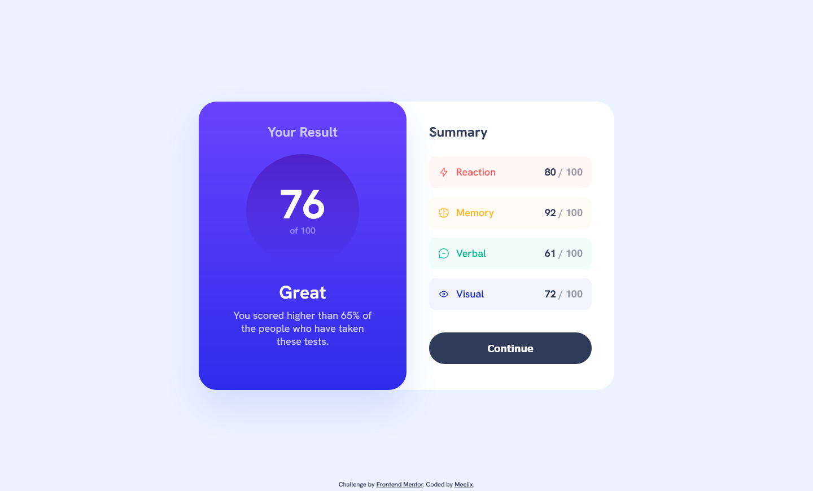

# Frontend Mentor - Results summary component solution

This is a solution to the [Results summary component challenge on Frontend Mentor](https://www.frontendmentor.io/challenges/results-summary-component-CE_K6s0maV). Frontend Mentor challenges help you improve your coding skills by building realistic projects.

## The challenge

Users should be able to:

- [x] View the optimal layout for the interface depending on their device's screen size
- [x] See hover and focus states for all interactive elements on the page
- [ ] **Bonus**: Use the local JSON data to dynamically populate the content

### Screenshot



### Links

- [Solution URL](https://your-solution-url.com)
- [Live Site URL](https://meelix.github.io/frontendmentor-results-summary/)

## My process

### Built with

- Semantic HTML5 markup
- CSS custom properties
- Flexbox
- CSS Grid
- CSS native nesting
- CSS color-mix
- Mobile-first workflow

### What I learned

css color-mix

this sets the background to be red with a 5% opacity on a white background while still being a solid color.
so basicaly it precomputes transparent colors without actually being transparent.

```css
.someclass {
  background-color: color-mix(in srgb, red 5%, white);
}
```

https://developer.mozilla.org/en-US/docs/Web/CSS/color_value/color-mix

### Useful resources

- [Transfonter](https://transfonter.org/) - Usefull to reduce font file sizes.